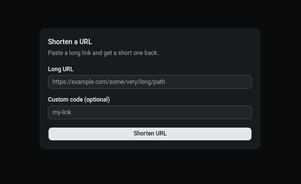

# Frontend — React + Vite + Tailwind + shadcn

## Prerequisites

- Node.js v18+
- The backend running on `http://localhost:8080` (see `../backend/README.md`)

## 1. Install dependencies

```bash
cd frontend
npm install
```

## 2. Configure the dev proxy

`vite.config.ts` should already include a proxy so `/api/*` requests
are forwarded to the Rust backend during development:

```ts
server: {
  proxy: {
    '/api': 'http://localhost:8080'
  }
}
```

## 3. Run

```bash
npm run dev
```

Open `http://localhost:5173`.

## 4. Build for production

```bash
npm run build
```

Output goes to `dist/`. Preview the production build locally with:
```bash
npm run preview
```

---

## Project Structure

```
src/
├── api/
│   ├── axios.ts        # axios instance (proxy handles baseURL)
│   └── urls.ts          # shortenUrl(), getStats() — backend calls
├── components/
│   ├── ui/               # shadcn components
│   ├── ShortenForm.tsx   # create-short-link form
│   ├── ResultCard.tsx     # displays the created short link
│   └── Navbar.tsx
├── pages/
│   ├── HomePage.tsx       # "/" — shorten form + result
│   └── StatsPage.tsx      # "/stats/:code" — click stats
└── App.tsx                # router setup
```

## Icons

Uses [Hugeicons](https://hugeicons.com):
```bash
npm install @hugeicons/react @hugeicons/core-free-icons
```

```tsx
import { HugeiconsIcon } from "@hugeicons/react"
import { Copy01Icon } from "@hugeicons/core-free-icons"

<HugeiconsIcon icon={Copy01Icon} size={16} />
```

## Pages

| Route | Description |
|-------|-------------|
| `/` | Form to shorten a URL (with optional custom code). Shows the result with a copy button. |
| `/stats/:code` | Shows the original URL, click count, and creation date for a short code. |

## Preview


